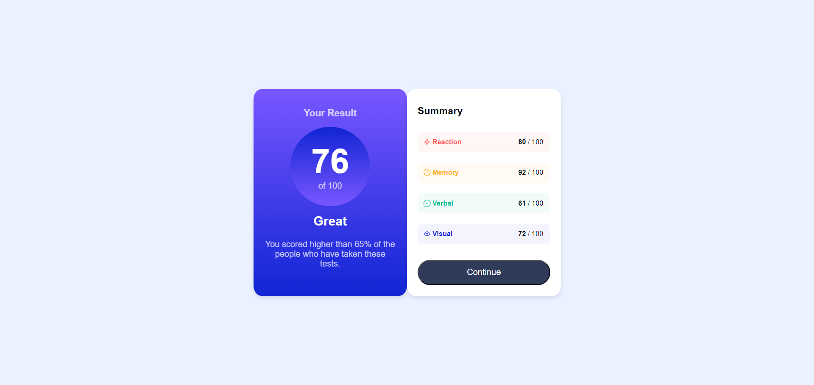
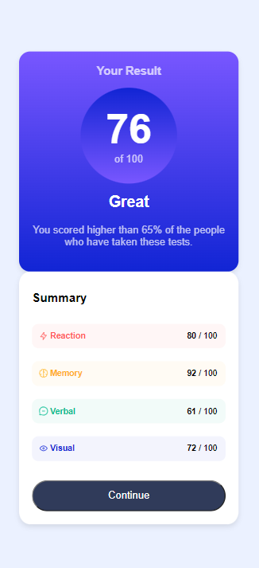

# Frontend Mentor - Results-Summary-Component

This is a solution to the [Results-Summary-Component](https://www.frontendmentor.io/challenges/results-summary-component-CE_K6s0maV).
## Table of contents

- [Overview](#overview)
  - [Screenshot](#screenshot)
  - [Links](#links)
- [My process](#my-process)
  - [Built with](#built-with)
- [Author](#author)

## Overview

### Screenshot

### Links

- Solution URL:  [Solution site](https://www.frontendmentor.io/solutions/resultssummarycomponent-mAo6UxE5Ub)
- Live Site URL:  [Live site](https://ahmadikhdair.github.io/results-summary-component/)

## My process

### Built with

- Semantic HTML5 markup
- CSS
- Flexbox
- CSS Grid

## Author

- LinkedIn -  [Ahmad Ikhdair](https://www.linkedin.com/in/ahmad-ikhdair/)
- Frontend Mentor -  [Ahmad Ikhdair](https://www.frontendmentor.io/profile/AhmadIkhdair)
